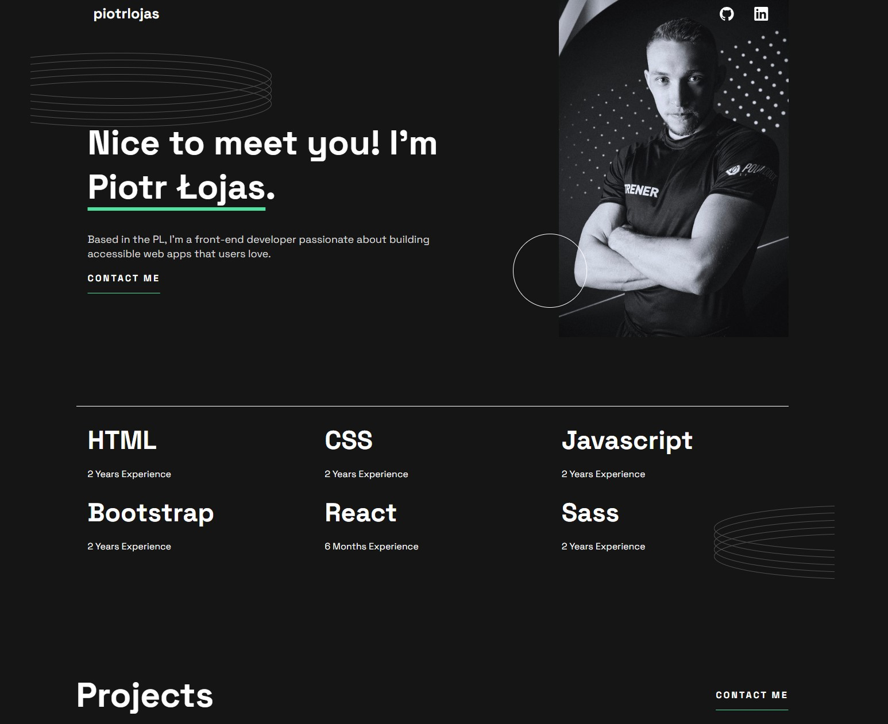

# Frontend Mentor - Single-page developer portfolio solution

This is my solution to the [Single-page developer portfolio challenge on Frontend Mentor](https://gwynbleidd222.github.io/Main-Single-Page-Portfolio/). Frontend Mentor challenges help you improve your coding skills by building realistic projects. 

## Overview

### The challenge

Users should be  able to:

- Receive an error message when the `form` is submitted if:
  - Any field is empty
  - The email address is not formatted correctly
- View the optimal layout for the interface depending on their device's screen size
- See hover and focus states for all interactive elements on the page
- **Bonus**: Hook the form up so it sends and stores the user's enquiry (you can use a spreadsheet or Airtable to save the enquiries)
- **Bonus**: Add your own details (image, skills, projects) to replace the ones in the design

### Screenshot

### Links

- Solution URL: [https://github.com/Gwynbleidd222/Main-Single-Page-Portfolio]
- Live Site URL: [https://gwynbleidd222.github.io/Main-Single-Page-Portfolio/]

## My process

### Built with

- Semantic HTML5 markup
- CSS custom properties
- Flexbox
- CSS Grid
- Mobile-first workflow
- SASS

## Author

- Website - [Add your name here](https://github.com/Gwynbleidd222/Main-Single-Page-Portfolio)
- Frontend Mentor - [@yourusername](https://www.frontendmentor.io/profile/Gwynbleidd222)

